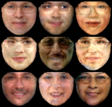
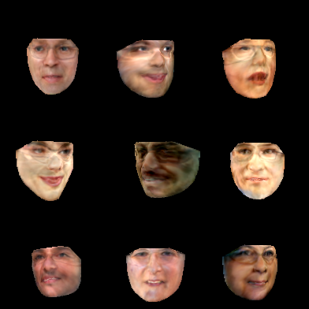

# Face Reconstructions with Active Appearance model
Given images with landmarks (keypoints) all images are warped (patch size) into the mean keypoint shape
and a PCA is learned over centered (warped) images.

Reconstruction is then done by first centering, reconstruction with the transposed projection matrix of PCA
and then warping again to the original shape

# Run

Create centered data, learn KPS and Image PCA models and reconstruct test data with 

```
$ python3 main.py
```

## Expected results
### Samples

 | 

# TODOS
- [ ] Use TPS (Thin plate splines) for warping instead of triangle-mesh non-continous warping

# Credits
- The Warping code is a simplified version of: [Active-Appearance-Models](https://github.com/VipulRamtekkar/Active-Appearance-Models/tree/master/References)
- Whos work is very much appriciated MMPCA code is from [torch-mfa](https://github.com/eitanrich/torch-mfa):

# Cites
```
@article{cootes2001active,
  title={Active appearance models},
  author={Cootes, Timothy F. and Edwards, Gareth J. and Taylor, Christopher J.},
  journal={IEEE Transactions on pattern analysis and machine intelligence},
  volume={23},
  number={6},
  pages={681--685},
  year={2001},
  publisher={IEEE}
}

@inproceedings{richardson2018gans,
  title={On gans and gmms},
  author={Richardson, Eitan and Weiss, Yair},
  booktitle={Advances in Neural Information Processing Systems},
  pages={5847--5858},
  year={2018}
}
```

