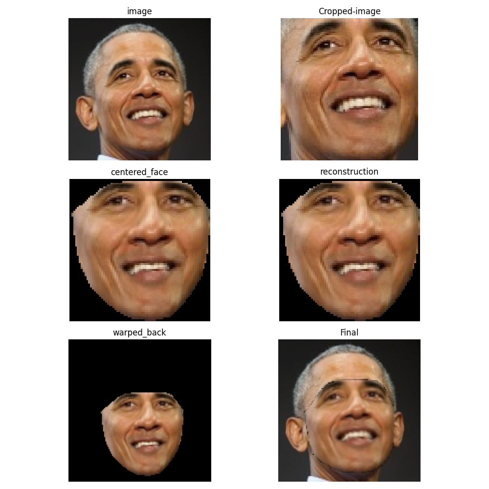
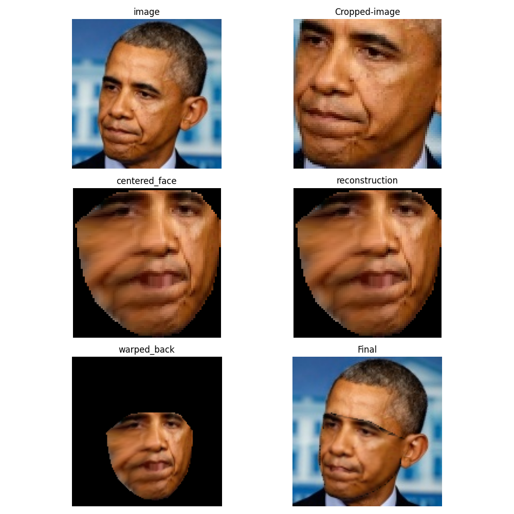

# Reconstructions with Active Appearance model
Given images with landmarks (keypoints) all images are warped (patch size) into the mean keypoint shape
and a PCA is learned over centered (warped) images.

Reconstruction is then done by first centering, reconstruction with the transposed projection matrix of PCA
and then warping again to the original shape

# Run

Exctract the Obama dataset by

```
$ unzip data/100-shot-obama_128/img.zip -d data/100-shot-obama_128/ 
```

Create centered data, learn KPS and Image PCA models and reconstruct test data with 

```
$ python3 main.py
```


 | 

